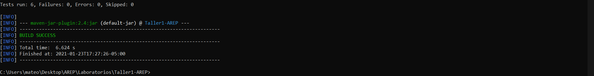
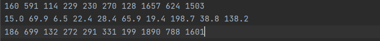
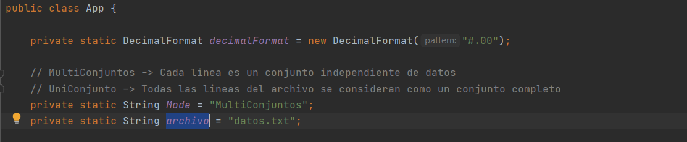
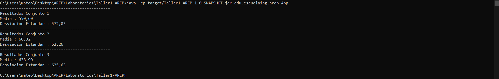
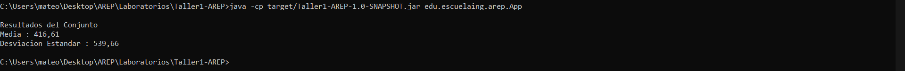
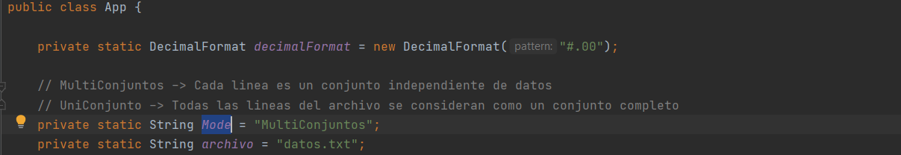
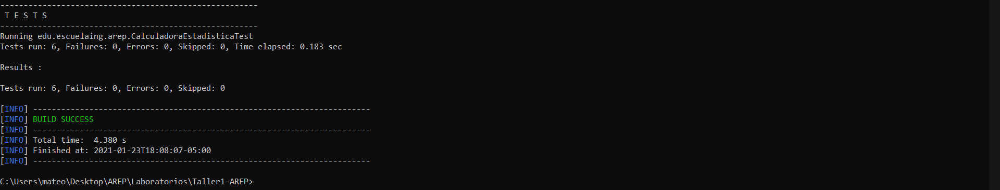

# Taller 1 - Introducción Maven-Git

Programa diseñado en Java con el propósito de calcular la media y la desviación
estándar de un grupo de n datos que seran extraidos de un archivo de texto, la estructura
de datos utilizada es una implementación de una Lista Enlazada.

## Información Del Proyecto

Haga click en este enlace para ver la documentación completa del proyecto.

### Pre-Requisitos

Para correr este proyecto necesita los siguientes programas instalados, se adjuntan los
links de como descargarlos:
> - [Java 8](https://www.java.com/es/download/)
> - [Apache Maven](http://maven.apache.org/download.html#Installation)

Adicionalmente se recomienda tener descargado los siguientes programas:
> - [Git](http://git-scm.com/book/en/v2/Getting-Started-Installing-Git)

### Instalación

1. Clonación o Descarga del Proyecto:

   - Para **Clonar** el proyecto utilice el siguiente comando en la ventana de comandos:
      ```
      git clone https://github.com/Candres1019/Taller1-AREP.git
      ```
   - Para **Descargar** el proyecto de click [aqui](https://github.com/Candres1019/Taller1-AREP/archive/main.zip) ,
  la descarga comenzara de manera automatica.

2. En una ventana de comandos ejecute el siguiente comando, dentro de la carpeta del proyecto:
    ```
    mvn package
    ```
    Sabremos que todo salio bien, si vemos en consola lo siguiente:
   
   
3. Por defecto en el proyecto tenemos el archivo datos.txt el cual es utilizado para realizar los calculos por defecto
   este archivo puede modificarlo, pero siempre teniendo el mismo sentido de los datos, es decir
   separados por espacios en blanco y los numeros utilizando "." para definir decimales.
   
   
   Puede utilizar otro nombre de archivo o ruta para el mismo, pero si desea hacerlo debe de cambiar en la clase
   App.java en la linea "21" el atributo "archivo" con la ruta o nombre del archivo nuevo que desea usar, y volver a
   comenzar el proceso de instalación desde el punto 2.
    

4. El programa tiene dos modalidades de uso el modo "MultiConjuntos" que significa que cada una de las lineas del archivo
   de texto refiere a un conjunto de numeros independiente por el cual tendra salidas y calculos para cada uno de ellos,
   Ejemplo:
   
   y el modo "UniConjunto" que significa que todo el archivo de texto es un conjunto de numeros por lo cual solo tendra
   el resultado de la media y desviacion estandar de todos los datos del archivo y no por separado, Ejemplo:
   
   
   Por defecto el programa viene con el modo "MultiConjuntos", pero si desea cambiarlo debe cambiar en la clase
   App.java en la linea "20" el atributo "Mode" con el modo que desea usar, y volver a comenzar el proceso de 
   instalación desde el punto 2.
   
   
5. Para ejecutar la aplicación utilizamos en la ventana de comandos el siguiente comando:
    ```
    java -cp target/Taller1-AREP-1.0-SNAPSHOT.jar edu.escuelaing.arep.App
    ```
    Con esto veremos el resultado de los datos que ingresamos anteriormente:
    
   
6. Por defecto se creo la documentacion JavaDoc y fue dejada en el directorio /Javadoc, si desea generar uno nuevo
   utilice el siguiente comando, esta documentacion quedara en el directorio /target/site/apidocs :
   ```
    mvn javadoc:javadoc
    ```
## Ejecución de pruebas

   En una ventana de comandos utilice el siguiente comando:
   ```
    mvn test
   ```
   Si todo sale de manera correcta deberia ver esto en su ventana de comandos:
   
   
   Estas pruebas estan hechas para asegurar el correcto funcionamiento del calculo de la media y desviación estandar,
   estos calculos fueron previamente hechos en libros de estadistica y fueron utilizados para asegurar la veracidad de
   los mismos, adicionalmente el programa esta diseñado para tener una precision de 2 decimales.

## Construido Con

* [Java 8](https://www.java.com/es/) - Lenguaje de Programación.
* [JUnit](https://junit.org/junit5/) - Pruebas de Unidad.
* [Maven](https://maven.apache.org/) - Manejo de dependecias.

## Authors

* **Andres Mateo Calderón Ortega** - [Candres1019](https://github.com/Candres1019)

# Licencia
Este proyecto está licenciado bajo la GNU v3.0 - ver el archivo [LICENSE.md](https://github.com/Candres1019/Taller1-AREP/blob/main/LICENSE) para más detalles